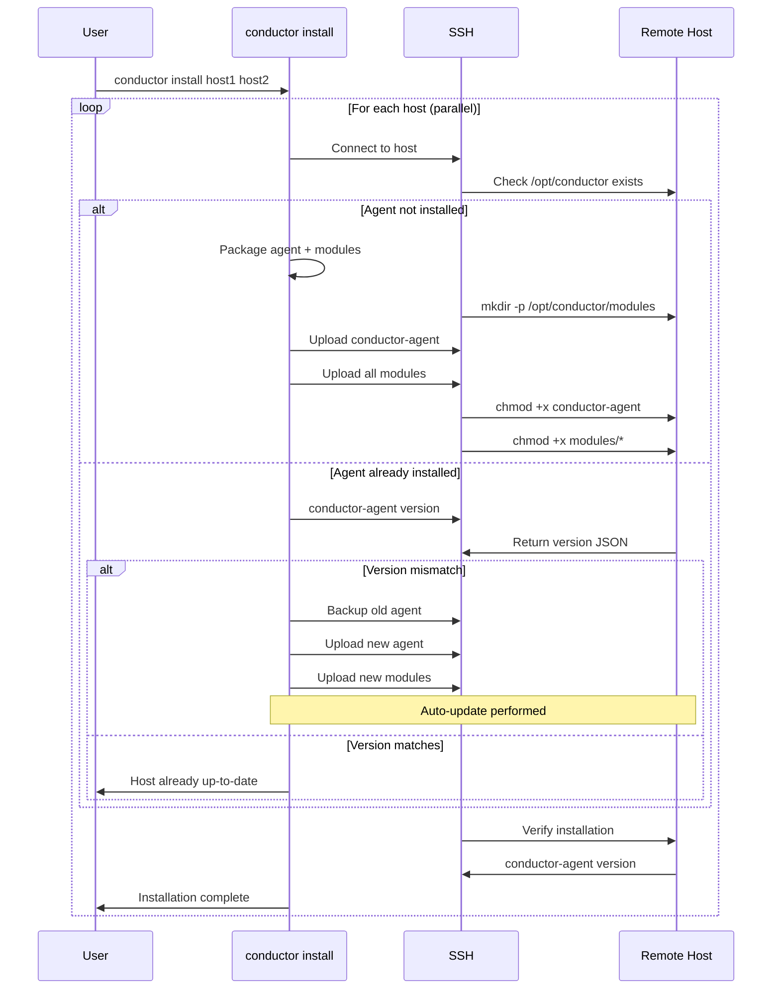
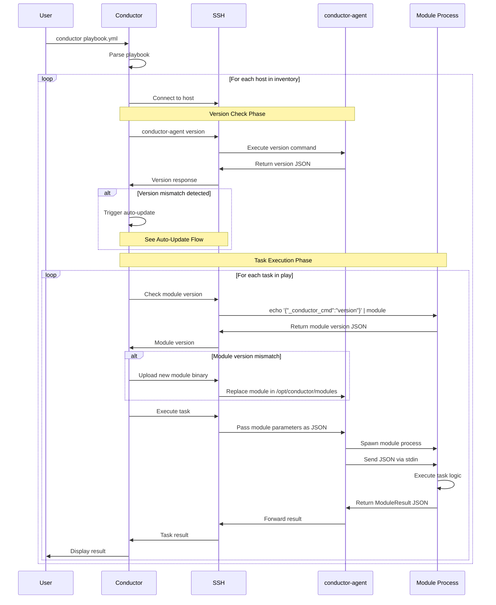
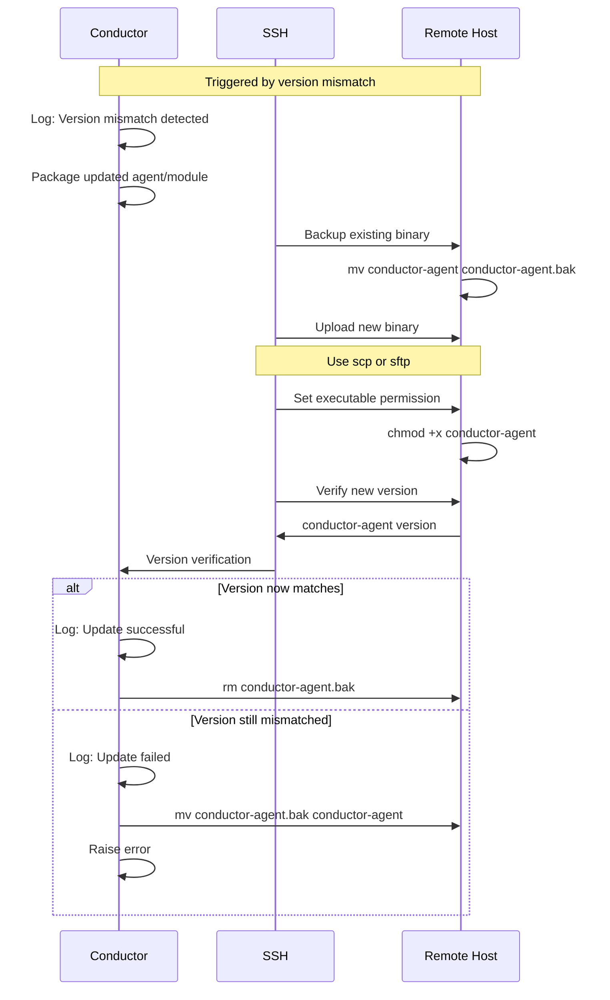

# Conductor Agent Architecture

## Overview

The Conductor Agent (`conductor-agent`) is a lightweight, standalone executable deployed to remote hosts that enables Conductor to execute playbooks without requiring a full Conductor installation on target systems. This follows the Ansible push-model architecture where the control node (running full Conductor) connects to managed nodes (running only the lightweight agent) via SSH.

### Design Goals

1. **Minimal footprint** - Single executable with bundled modules at `/opt/conductor`
2. **Version consistency** - Automatic version checking and updating on every invocation
3. **SSH-based deployment** - Push model using `conductor install` command
4. **Backward compatibility** - Maintains existing module protocol (JSON stdin/stdout)
5. **No persistent services** - Agent is invoked on-demand, not a daemon

### Architecture Overview

```text
┌─────────────────────────────────────────────────────────────────┐
│  Control Node (Full Conductor Installation)                     │
│  - conductor CLI                                                │
│  - PlaybookExecutor, TaskExecutor                               │
│  - ModuleExecutor with version checking                         │
│  - SSH client for remote execution                              │
└────────────────────┬────────────────────────────────────────────┘
                     │
                     │ SSH Connection
                     │ (version check + module execution)
                     │
        ┌────────────▼────────────┐
        │  Managed Node(s)        │
        │  /opt/conductor/        │
        │  ├── conductor-agent    │
        │  └── modules/           │
        │      ├── conductor-     │
        │      │   module-shell   │
        │      ├── conductor-     │
        │      │   module-debug   │
        │      └── ...            │
        └─────────────────────────┘
```

## Installation Process

### `conductor install` Command

The `conductor install` command deploys the agent to one or more hosts via SSH.

**Command Syntax:**

```bash
conductor install host1 host2 host3
conductor install --user=admin --key=~/.ssh/id_rsa node1.example.com node2.example.com
```

### Installation Flow



**Installation Steps:**

1. **Pre-flight checks**
   - Test SSH connectivity to each host
   - Verify permissions (usually requires sudo)

2. **Package preparation**
   - Bundle `conductor-agent` executable
   - Bundle all discovered modules from local system
   - Create deployment package

3. **Remote deployment**
   - Create `/opt/conductor` directory structure
   - Upload agent executable
   - Upload module executables to `/opt/conductor/modules`
   - Set executable permissions (755)
   - Optionally create symlink: `/usr/local/bin/conductor-agent`

4. **Verification**
   - Execute `conductor-agent version` remotely
   - Compare returned version with expected version
   - Report installation status per host

## Execution Process with Version Checking

### Overview of Process

Every time Conductor executes a playbook against remote hosts, it performs version checking before executing tasks to ensure control node and managed nodes are synchronized.

### Execution Flow



### Version Checking Details

**Session-level caching:**

- Version checks are cached per-host per-session
- Re-check only on: new session, manual request, or after update
- Avoids redundant checks on every task (only once per playbook run)

**Version comparison logic:**

- **Major version mismatch**: Auto-update required
- **Minor version mismatch**: Warning logged, update recommended
- **Patch version mismatch**: No action, backward compatible

## Auto-Update Process

### Auto-Update Flow



### Update Strategy

**Agent Update:**

- Atomic replacement using `mv` (rename)
- Backup old version as `.bak`
- Verify new version after upload
- Rollback on verification failure

**Module Update:**

- Individual module updates possible
- Modules versioned independently from agent
- Replace specific module binary in `/opt/conductor/modules/`
- No service restart needed (modules invoked per-task)

**Update Triggers:**

- **Automatic**: Every playbook execution checks versions
- **Manual**: `conductor install --force host1` to force reinstall
- **Selective**: `conductor update-modules shell debug host1` to update specific modules

## File Structure at `/opt/conductor`

```text
/opt/conductor/
├── conductor-agent                    # Main agent executable
├── conductor-agent.bak               # Backup during updates (temporary)
├── modules/                          # Module executables
│   ├── conductor-module-shell        # Shell module
│   ├── conductor-module-debug        # Debug module
│   ├── conductor-module-systemd      # Systemd module (if installed)
│   ├── conductor-module-template     # Template module (if installed)
│   └── ...                           # Additional modules
└── .version                          # Version metadata file (optional)
```

### Optional Version Metadata File

`/opt/conductor/.version` - JSON file for quick version lookup:

```json
{
  "agent_version": "0.3.0",
  "installed_at": "2025-12-10T10:30:00Z",
  "installed_by": "conductor install",
  "modules": {
    "shell": "0.3.0",
    "debug": "0.3.0",
    "systemd": "0.3.0"
  },
  "platform": "linux-x64",
  "dotnet_runtime": "10.0.0"
}
```

## JSON Schemas

### Agent Version Command

**Command:**

```bash
conductor-agent version
```

**Output Schema:**

```json
{
  "$schema": "http://json-schema.org/draft-07/schema#",
  "title": "AgentVersionInfo",
  "type": "object",
  "required": ["agent_version", "protocol_version", "platform"],
  "properties": {
    "agent_version": {
      "type": "string",
      "description": "Semantic version of the agent",
      "pattern": "^\\d+\\.\\d+\\.\\d+(-[a-zA-Z0-9]+)?$",
      "examples": ["0.3.0", "0.3.0-dev", "1.0.0-beta.1"]
    },
    "protocol_version": {
      "type": "string",
      "description": "Version of the module protocol supported",
      "pattern": "^\\d+\\.\\d+$",
      "examples": ["1.0", "2.0"]
    },
    "platform": {
      "type": "string",
      "description": "Operating system and architecture",
      "examples": ["linux-x64", "linux-arm64", "osx-x64", "win-x64"]
    },
    "dotnet_runtime": {
      "type": "string",
      "description": "Optional: .NET runtime version if applicable",
      "examples": ["10.0.0", "8.0.5"]
    },
    "modules": {
      "type": "object",
      "description": "Installed modules and their versions",
      "additionalProperties": {
        "type": "string"
      },
      "examples": [{
        "shell": "0.3.0",
        "debug": "0.3.0",
        "systemd": "0.3.0"
      }]
    },
    "module_search_paths": {
      "type": "array",
      "description": "Paths where modules are searched",
      "items": {
        "type": "string"
      },
      "examples": [["/opt/conductor/modules"]]
    },
    "installed_at": {
      "type": "string",
      "format": "date-time",
      "description": "ISO 8601 timestamp of installation",
      "examples": ["2025-12-10T10:30:00Z"]
    }
  }
}
```

**Example Output:**

```json
{
  "agent_version": "0.3.0",
  "protocol_version": "1.0",
  "platform": "linux-x64",
  "dotnet_runtime": "10.0.0",
  "modules": {
    "shell": "0.3.0",
    "debug": "0.3.0"
  },
  "module_search_paths": [
    "/opt/conductor/modules"
  ],
  "installed_at": "2025-12-10T10:30:00Z"
}
```

### Module Version Command

**Command:**

```bash
echo '{"_conductor_cmd":"version"}' | conductor-module-shell
```

**Input Schema:**

```json
{
  "$schema": "http://json-schema.org/draft-07/schema#",
  "title": "ModuleVersionRequest",
  "type": "object",
  "required": ["_conductor_cmd"],
  "properties": {
    "_conductor_cmd": {
      "type": "string",
      "enum": ["version"],
      "description": "Special command to request version information"
    }
  }
}
```

**Output Schema:**

```json
{
  "$schema": "http://json-schema.org/draft-07/schema#",
  "title": "ModuleVersionResponse",
  "type": "object",
  "required": ["success", "changed", "message", "facts"],
  "properties": {
    "success": {
      "type": "boolean",
      "const": true,
      "description": "Always true for version requests"
    },
    "changed": {
      "type": "boolean",
      "const": false,
      "description": "Always false for version requests"
    },
    "message": {
      "type": "string",
      "description": "Human-readable version message",
      "examples": ["Module version 0.3.0"]
    },
    "facts": {
      "type": "object",
      "required": ["module_name", "module_version", "protocol_version"],
      "properties": {
        "module_name": {
          "type": "string",
          "description": "Name of the module",
          "examples": ["shell", "debug", "systemd"]
        },
        "module_version": {
          "type": "string",
          "description": "Semantic version of the module",
          "pattern": "^\\d+\\.\\d+\\.\\d+(-[a-zA-Z0-9]+)?$",
          "examples": ["0.3.0", "1.2.3-beta"]
        },
        "protocol_version": {
          "type": "string",
          "description": "Module protocol version supported",
          "pattern": "^\\d+\\.\\d+$",
          "examples": ["1.0", "2.0"]
        },
        "capabilities": {
          "type": "array",
          "description": "Optional: Module capabilities/features",
          "items": {
            "type": "string"
          },
          "examples": [["async", "sudo", "check_mode"]]
        },
        "build_date": {
          "type": "string",
          "format": "date-time",
          "description": "Optional: Build timestamp",
          "examples": ["2025-12-10T08:00:00Z"]
        },
        "dependencies": {
          "type": "object",
          "description": "Optional: External dependencies required",
          "additionalProperties": {
            "type": "string"
          },
          "examples": [{
            "systemctl": ">=230"
          }]
        }
      }
    }
  }
}
```

**Example Output:**

```json
{
  "success": true,
  "changed": false,
  "message": "Shell module version 0.3.0",
  "facts": {
    "module_name": "shell",
    "module_version": "0.3.0",
    "protocol_version": "1.0",
    "capabilities": ["async", "check_mode"],
    "build_date": "2025-12-10T08:00:00Z"
  }
}
```

## Integration with Existing Code

### ModuleBase Enhancement

The existing `ModuleBase.cs` needs to handle the version command:

```csharp
// Conceptual enhancement to ModuleBase
protected virtual ModuleResult GetVersionInfo()
{
    return Success(
        message: $"{ModuleName} module version {ModuleVersion}",
        changed: false,
        facts: new Dictionary<string, object?>
        {
            ["module_name"] = ModuleName,
            ["module_version"] = ModuleVersion,
            ["protocol_version"] = "1.0",
            ["build_date"] = GetBuildDate()
        }
    );
}
```

### ModuleExecutor Enhancement

The existing `ModuleExecutor.cs` needs version checking capability:

```csharp
// Conceptual integration - new method
public async Task<ModuleVersionInfo> GetModuleVersionAsync(
    string moduleName,
    CancellationToken cancellationToken = default)
{
    // Send special version command
    var versionVars = new Dictionary<string, object?>
    {
        ["_conductor_cmd"] = "version"
    };

    var result = await ExecuteAsync(moduleName, versionVars,
        timeout: TimeSpan.FromSeconds(5),
        cancellationToken);

    return ParseVersionInfo(result.Facts);
}
```

### New Components Needed

**RemoteModuleExecutor** - SSH wrapper for remote execution:

- Manages SSH connections to managed nodes
- Implements version checking logic
- Handles auto-update mechanism
- Wraps module execution with SSH tunneling

**conductor install** CLI command:

- New console application or subcommand
- Implements parallel SSH deployment
- Handles version comparison and updates
- Provides progress reporting

## Backward Compatibility

### Existing Module Protocol

The version checking system is **fully backward compatible**:

1. **Standard module execution** - Unchanged
   - Input: `{"cmd": "echo hello"}` via stdin
   - Output: Standard `ModuleResult` JSON via stdout
   - Existing modules work without modification

2. **Version command** - New capability
   - Input: `{"_conductor_cmd": "version"}` via stdin
   - Output: `ModuleResult` with version facts
   - Modules without version support return normal error

3. **Graceful degradation**
   - Module doesn't support version: Conductor logs warning, continues
   - Agent not found: Conductor error with install instructions
   - Version mismatch without auto-update: Warning, execution continues

## Security Considerations

### SSH Authentication

- Support key-based authentication (default, recommended)
- Support password authentication with secure prompts
- Support SSH agent forwarding
- Support custom SSH ports and options

### File Permissions

- `/opt/conductor/` owned by root or dedicated conductor user
- Agent executable: `755` (rwxr-xr-x)
- Module executables: `755` (rwxr-xr-x)
- No world-writable files

### Update Security

- Verify checksums of uploaded binaries
- Use secure channels (SSH/SCP) for transfers
- Atomic updates to prevent partial state
- Backup and rollback capability

### Execution Security

- Agent runs with user privileges (not setuid)
- Modules inherit agent's privileges
- Sudo elevation explicit in playbooks (like Ansible's `become`)

## Performance Considerations

### Version Check Caching

- Cache version checks per-host per-session
- Re-check only on: new session, manual request, or after update
- Avoid checking on every task (once per playbook run)

### Parallel Installation

- Install to multiple hosts in parallel
- Default: 5 concurrent installations
- Configurable: `conductor install --parallel=10 host1 host2 ...`

### Module Transfer Optimization

- Transfer only changed modules (checksum comparison)
- Compress modules during transfer
- Resume interrupted transfers

## Error Handling

### Installation Errors

| Error Condition | Behavior |
|----------------|----------|
| SSH connection failed | Skip host, log error, continue with remaining hosts |
| Insufficient permissions | Report error, suggest sudo usage |
| Upload failed | Retry 3 times, then report error |
| Version verification failed | Rollback, report error |

### Execution Errors

| Error Condition | Behavior |
|----------------|----------|
| Agent not found | Error: "Agent not installed, run 'conductor install HOST'" |
| Module not found | Error: "Module 'name' not found on remote host" |
| Version check timeout | Warning: "Version check timed out, continuing without check" |
| Auto-update failed | Error: "Failed to update, manual intervention required" |

### Graceful Degradation

- Missing agent → Error with install instructions
- Missing module → Error with specific module name
- Version check failure → Warning + continue execution
- Update failure → Error + rollback + manual update instructions

## Usage Examples

### Installing Agent

```bash
# Install to single host
conductor install web-server-01

# Install to multiple hosts
conductor install web-01 web-02 db-01 cache-01

# Install with custom SSH options
conductor install --user=deploy --key=~/.ssh/deploy_key --port=2222 app-server

# Force reinstall
conductor install --force web-01

# Install in parallel to many hosts
conductor install --parallel=10 web-{01..20}
```

### Running Playbooks

```bash
# Normal execution (version check automatic)
conductor playbook.yml

# Skip version checking (emergency use)
conductor playbook.yml --skip-version-check

# Verbose mode shows version checking details
conductor playbook.yml -vvv
```

### Manual Version Checking

```bash
# Check agent version on remote host
ssh web-01 "/opt/conductor/conductor-agent version"

# Check module version on remote host
ssh web-01 "echo '{\"_conductor_cmd\":\"version\"}' | /opt/conductor/modules/conductor-module-shell"

# Compare versions across hosts
for host in web-{01..05}; do
  echo -n "$host: "
  ssh $host "/opt/conductor/conductor-agent version" | jq -r '.agent_version'
done
```

### Manual Updates

```bash
# Update agent on specific hosts
conductor update-agent web-01 web-02

# Update specific modules on hosts
conductor update-modules shell systemd web-01

# Update everything
conductor update-all web-01 web-02
```

## Implementation Roadmap

### Phase 1: Agent Core (Weeks 1-2)

- Create `conductor-agent` console application
- Implement `version` command
- Implement `exec` command for module execution
- Add version info to assembly metadata
- Unit tests for agent

### Phase 2: Installation Tool (Weeks 2-3)

- Create `conductor install` command
- Implement SSH connectivity
- Implement file upload (agent + modules)
- Implement permission setting
- Add parallel installation support
- Integration tests for installation

### Phase 3: Version Checking (Weeks 3-4)

- Enhance `ModuleBase` with version support
- Update `ModuleExecutor` with version checking
- Create `RemoteModuleExecutor` wrapper
- Implement version comparison logic
- Unit tests for version checking

### Phase 4: Auto-Update (Weeks 4-5)

- Implement agent update flow
- Implement module update flow
- Add backup and rollback logic
- Add atomic update mechanism
- Integration tests for auto-update

### Phase 5: Polish & Documentation (Weeks 5-6)

- Error handling improvements
- Performance optimization
- User documentation
- Tutorial and examples
- End-to-end testing

## Related Documentation

- [Module System](module-system.md) - Comprehensive module system documentation
- [Process-Based Modules](process-based-modules.md) - Architecture deep-dive
- [CLAUDE.md](../CLAUDE.md) - Project overview and instructions

## Related Files

**Current Implementation:**

- `src/FulcrumLabs.Conductor.Core/Modules/ModuleExecutor.cs` - Module execution engine
- `src/FulcrumLabs.Conductor.Core/Modules/ModuleRegistry.cs` - Module discovery
- `src/FulcrumLabs.Conductor.Modules.Common/ModuleBase.cs` - Module base class
- `Directory.Build.props` - Version configuration (currently 0.3.0-dev)

**New Components (to be created):**

- `src/FulcrumLabs.Conductor.Agent/` - Agent application
- `src/FulcrumLabs.Conductor.Cli/Commands/InstallCommand.cs` - Install command
- `src/FulcrumLabs.Conductor.Core/Remote/RemoteModuleExecutor.cs` - Remote execution wrapper
